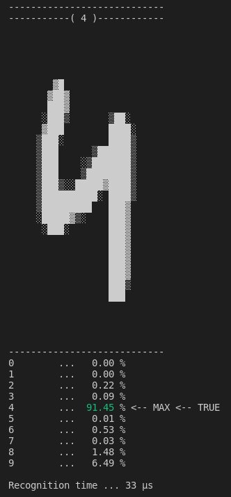

# Look mom, no Python!



This project is my attempt to implement simplest two layer neural network using Rust for recognition of handwritten digits.
It is based on project is base on Bot Academy project [Neural network from scratch](https://github.com/Bot-Academy/NeuralNetworkFromScratch/blob/master/nn.py) (see on [YouTube](https://www.youtube.com/watch?v=9RN2Wr8xvro)).

My implementation uses [`ndarray`](https://docs.rs/ndarray/latest/ndarray/) crate for linear algebra math, [`csv`](https://docs.rs/csv/latest/csv/) crate for reading training and testing set from CSV files, [`image`](https://docs.rs/image/latest/image/) crate for reading my own images and [`colored`](https://docs.rs/colored/latest/colored/) for coloring recognition results.

This is second attempt. In previous one, I tried more OOP approach using modules, but it started to be mudy. I left variable names same as Academy Bot's project so its explanation can be used.

I also tried to use original [MNIST data set](http://yann.lecun.com/exdb/mnist/) in IDX format with [`mnist`](https://docs.rs/mnist/latest/mnist/) crate, but I ran out of memory. Current solution, reading and processing images one by one, works fine.

I planned to use [`plotters`](https://docs.rs/plotters/latest/plotters/) crate for image visualization, but ended with my simple ASCII solution using `ndarray` `reshape` method and my favorite Rust feature pattern matching. 

## Setup

Implementation expects `mnist_train.csv` and `mnist_test.csv` in `data` directory of the project. You can download them e.g. on [Joseph Chet Redmon site](https://pjreddie.com/projects/mnist-in-csv/). 

## Notes

For generating blank testing images, `convert` command from [ImageMagic](https://imagemagick.org/index.php) was used.
```bash
convert -size 28x28 xc:white empty.png
``` 
For image editing, I used [Pinta](https://www.pinta-project.com/).